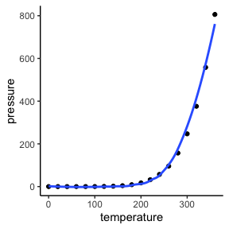

Lab Examples, code and content
================

The repository provides some examples of how to create your lab
write-ups such that I can view and provide feedback within GitHub
Classroom.

The first few lines of your `.Rmd` file will be a YAML. They should look
something like this:

``` html
---
title: "Title"
author: "Your name"
date: "the date"
output: github_document
---
```

There are many other options you can add to your YAML, but these are the
basics. Some others that I use quite often are `toc: "true"` to add a
table of contents and `urlcolor: "cyan"` to differentiate hyperlinks by
coloring them light blue.

You can now complete your writeup in between “chunks” of code (see the
`README.Rmd`).

# 1 Examples

Below are a bunch of examples of things you can add to your report. The
code for creating them can be found in `README.md`.

## 1.1 Plots

``` r
library(tidyverse)
```

    ## ── Attaching packages ─────────────────────────────────────── tidyverse 1.3.2 ──
    ## ✓ ggplot2 3.3.5     ✓ purrr   0.3.4
    ## ✓ tibble  3.1.6     ✓ dplyr   1.0.8
    ## ✓ tidyr   1.2.0     ✓ stringr 1.4.0
    ## ✓ readr   2.1.2     ✓ forcats 0.5.2
    ## ── Conflicts ────────────────────────────────────────── tidyverse_conflicts() ──
    ## x dplyr::filter() masks stats::filter()
    ## x dplyr::lag()    masks stats::lag()

``` r
# create a plot
  ggplot(data = pressure, aes(x = temperature, y = pressure)) +
    geom_point() +
    theme_classic() +
    geom_smooth(se = F)
```

    ## `geom_smooth()` using method = 'loess' and formula 'y ~ x'

<figure>

<figcaption aria-hidden="true">Figure 1.1: Example plot.</figcaption>
</figure>

You can reference a plot, such as Figure
<a href="#fig:plotname">1.1</a>, using the syntax `\@ref(fig:plotname)`
inside the markdown text if you install the `bookdown` R package and
include the following in the YAML:

``` html
---
output:
  bookdown::github_document2
---
```

## 1.2 Tables

Tables can be rendered straight from dataframes using the `kableExtra`
package.

``` r
library(kableExtra)
```

    ## 
    ## Attaching package: 'kableExtra'

    ## The following object is masked from 'package:dplyr':
    ## 
    ##     group_rows

``` r
# pass a few lines of a dataframe to kable
  head(pressure) %>%
    kable(
      caption = "An example table.",
      label = "eg-tab"
    ) %>%
    kable_classic(full_width = FALSE) %>%
    kable_styling(
      bootstrap_options = c("striped", "hover"), full_width = FALSE
    )
```

<table class=" lightable-classic table table-striped table-hover" style="font-family: &quot;Arial Narrow&quot;, &quot;Source Sans Pro&quot;, sans-serif; width: auto !important; margin-left: auto; margin-right: auto; width: auto !important; margin-left: auto; margin-right: auto;">
<caption>

Table 1.1: An example table.

</caption>
<thead>
<tr>
<th style="text-align:right;">

temperature

</th>
<th style="text-align:right;">

pressure

</th>
</tr>
</thead>
<tbody>
<tr>
<td style="text-align:right;">

0

</td>
<td style="text-align:right;">

0.0002

</td>
</tr>
<tr>
<td style="text-align:right;">

20

</td>
<td style="text-align:right;">

0.0012

</td>
</tr>
<tr>
<td style="text-align:right;">

40

</td>
<td style="text-align:right;">

0.0060

</td>
</tr>
<tr>
<td style="text-align:right;">

60

</td>
<td style="text-align:right;">

0.0300

</td>
</tr>
<tr>
<td style="text-align:right;">

80

</td>
<td style="text-align:right;">

0.0900

</td>
</tr>
<tr>
<td style="text-align:right;">

100

</td>
<td style="text-align:right;">

0.2700

</td>
</tr>
</tbody>
</table>

Tables such as Table <a href="#tab:eg-tab">1.1</a> can also be referred
to in the text by referencing the label supplied to the `label` argument
using the syntax `\@ref(tab:label)`.

**Note**: You may need to add `always_allow_html: true` to the YAML to
get some tables generated using `kableExtra` to render in a
`github_document`.

## 1.3 Hiding some R code

You can always supply the option `echo=FALSE` to a code chunk if you do
not want it to render. Keep your writeups short and to the point. Don’t
include any extaneous information or R code!

## 1.4 Other

### 1.4.1 Images

``

### 1.4.2 Hyperlinks

`[text to disply](url)`

### 1.4.3 Math

You can add math symbols using LaTeX syntax. For example,

    $$
      e^{i\pi} = -1
    $$

will render as a display equation like so:

$$
e^{i\pi} = -1
$$ while

    $e^{ix} = \cos(x) + i \sin(x)$

will render inline like so: $e^{ix} = \cos(x) + i \sin(x)$
