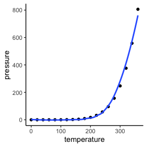

# Lab examples, code and content


<script src="README_files/libs/kePrint-0.0.1/kePrint.js"></script>
<link href="README_files/libs/lightable-0.0.1/lightable.css" rel="stylesheet" />


The repository provides examples of how to create your lab write-ups
such that I can view and provide feedback within GitHub Classroom.

The first few lines of your `.qmd` file will be a YAML. They should look
something like this:

``` html
---
title: "Title"
author: "Your name"
date: "the date"
format: gfm
---
```

There are many other options you can add to your YAML, but these are the
basics. Some others that I use quite often are `toc: true` to add a
table of contents and `urlcolor: cyan` to differentiate hyperlinks by
coloring them light blue. You can also use `format: pdf`, which I can
view in GitHub Classroom, but you will need a TeX installation for that
to work.

You can now complete your writeup in between “chunks” of code (see the
`README.qmd` and `example_lab_report.qmd` to compare the .qmd document
to the output).

# Examples

Below are a bunch of examples of things you can add to your lab reports.
The code for creating them can be found in `README.qmd`.

## Plots

``` r
library(tidyverse)
```

    ── Attaching core tidyverse packages ──────────────────────── tidyverse 2.0.0 ──
    ✔ dplyr     1.1.4     ✔ readr     2.1.5
    ✔ forcats   1.0.0     ✔ stringr   1.5.1
    ✔ ggplot2   3.5.1     ✔ tibble    3.2.1
    ✔ lubridate 1.9.3     ✔ tidyr     1.3.1
    ✔ purrr     1.0.2     
    ── Conflicts ────────────────────────────────────────── tidyverse_conflicts() ──
    ✖ dplyr::filter() masks stats::filter()
    ✖ dplyr::lag()    masks stats::lag()
    ℹ Use the conflicted package (<http://conflicted.r-lib.org/>) to force all conflicts to become errors

``` r
# create a plot
  ggplot(data = pressure, aes(x = temperature, y = pressure)) +
    geom_point() +
    theme_classic() +
    geom_smooth(se = F)
```

    `geom_smooth()` using method = 'loess' and formula = 'y ~ x'

<div id="fig-plotname">




Figure 1: Example plot.

</div>

You can add figure captions using the `#| fig-cap: "caption"` code block
argument **paired with** `#| label: "fig-name"`, where you replace
`name` with a unique identifier for each figure. **Note that prefacing
the name with `fig-` is necessary to get the caption to render and the
cross-referencing to work.** To reference a plot in the document, such
as <a href="#fig-plotname" class="quarto-xref">Figure 1</a>, use the
syntax `@fig-name` inside the markdown text.

## Tables

Tables can be rendered straight from dataframes using the `kableExtra`
package.

``` r
library(kableExtra)
```


    Attaching package: 'kableExtra'

    The following object is masked from 'package:dplyr':

        group_rows

``` r
# pass a few lines of a dataframe to kable
  head(pressure) %>%
    kable() %>%
    kable_classic(full_width = FALSE) %>%
    kable_styling(
      bootstrap_options = c("striped", "hover"), full_width = FALSE
    )
```

<div id="tbl-eg_tab">

Table 1: An example table.

<div class="cell-output-display">

| temperature | pressure |
|------------:|---------:|
|           0 |   0.0002 |
|          20 |   0.0012 |
|          40 |   0.0060 |
|          60 |   0.0300 |
|          80 |   0.0900 |
|         100 |   0.2700 |

</div>

</div>

Tables such as <a href="#tbl-eg_tab" class="quarto-xref">Table 1</a> can
also be referred to in the text by referencing the label supplied to the
`label` argument using the syntax `@tbl-label`.

**Note**: that you need to start the label with `tbl-` in order for the
cross-referencing to work (See the `README.qmd` for the code).

**Note**: You may need to add `prefer-html: true` to the YAML to get
some tables generated using `kableExtra` to render in a
`github_document`.

## Hiding some R code

You can always supply the option `#| echo: false` to a code chunk if you
do not want it to render. Keep your writeups short and to the point.
Don’t include any extraneous information or R code!

## Rendering results of r-code inline

If you want to add a value, for example the estimate of a parameter in a
statistical model, to the report, you can do so using the syntax below,
replacing `rcode` with some code that would print the result to the
standard out.

``` html
`r rcode`
```

## Other

### Images

``

### Hyperlinks

`[text to disply](url)`

### Math

You can add math symbols using LaTeX syntax. For example,

    $$e^{i\pi} = -1$$

will render as a display equation like so:

$$e^{i\pi} = -1$$ while

    $e^{ix} = \cos(x) + i \sin(x)$

will render inline like so: $e^{ix} = \cos(x) + i \sin(x)$
